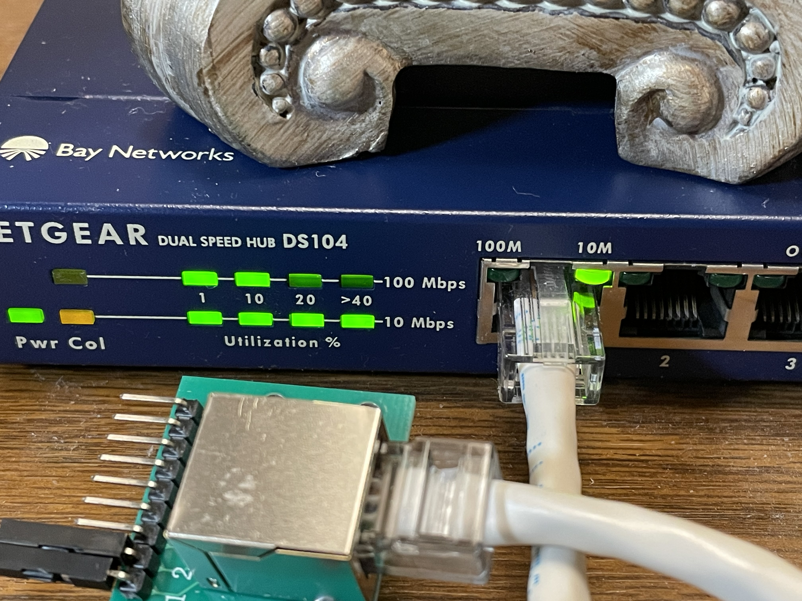

# Bitbanging UDP packets over 10baseT Ethernet on an FPGA

I copied the verilog from [fpgaforfun](https://www.fpga4fun.com/10BASE-T1.html).
Of course it didn't work right away. Partly I went down a wrong path with trying to 
use differential signals on the board. It also turns out the "uplink" switch on the 
hub needs to be depressed, and I might have had a bad connection connecting directly
from an ethernet cable which got solved by using the breakout board.

Glad I saved this ancient 10 Mbit router with fancy activity lights.
On the target host, about 10Mbps of traffic is successfully received.
